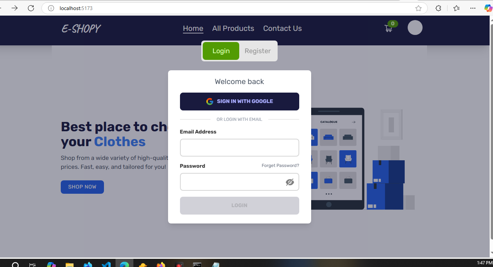

# Fullstack-Ecommerce


eShopy is an e-Commerce website that enables users to shop through variety of products(electronic / household / fashion) , add a product to their cart, and checkout. A user can either register their own username and password or Sign in With Google, or they can simply use the "Guest Login" button to navigate the website without registering.

## LIVE-Website-Link

## Getting-Started

Feel free to fork the project and change it to your likings. Try it out by cloning the repo to your local machine or download the zip

## Prerequisites

You need preferably the latest version of Chrome, and text editor.

#### Go here for Chrome: https://www.google.com/chrome/

#### VSCode is my go to: https://code.visualstudio.com/

## Installing

To get started follow this guide:

To Run Project:-

```
$ yarn dev or npm run dev
```

## Built With

- React Js
- Redux Toolkit
- Firebase
- Node.js
- Express.js
- Stripe
- Chart Js
- Email Js
- Tailwind CSS
- Daisy UI

## env

```js
 VITE_API_KEY =
 VITE_AUTH_DOMAIN =
  VITE_PROJECT_ID =
VITE_STORAGE_BUCKET =
  VITE_MESSAGING_SENDER_ID =
 VITE_APP_ID =
```
